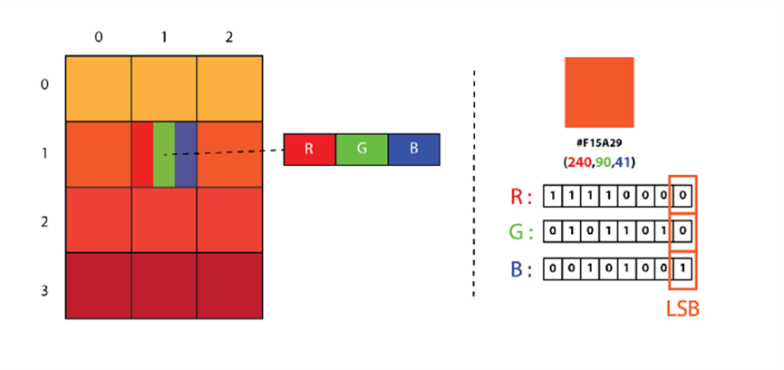
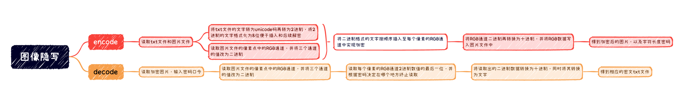

# LSB 图像隐写术

## 一、项目背景

### 1.隐写术
隐写术是一门关于信息隐藏的技巧与科学，所谓信息隐藏指的是不让除预期的接收者之外的任何人知晓信息的传递事件或者信息的内容。

### 2.LSB 隐写术
LSB 隐写术是一种图像隐写术技术，其中通过将每个像素的最低有效位替换为要隐藏的消息位来将消息隐藏在图像中。

### 3.实现原理
为了更好地理解，让我们将数字图像视为像素的二维阵列，每个像素包含取决于其类型和深度的值，使用最广泛的颜色模式RGB，这些值的范围为0–255之间。

可以使用 ASCII Table 将消息转换为十进制值，然后再转换为二进制。然后，我们逐个迭代像素值，将它们转换为二进制后，我们将每个最低有效位替换为序列中的消息位。
要解码编码图像，我们只需反转该过程，收集并存储每个像素的最后一位，然后将它们分成 8 组，并将其转换回 ASCII 字符以获取隐藏消息。

## 二、项目目标

### 1.主要目标
编写LSB图像隐写程序，包括：加密程序和解密程序。

### **2.**目标分解

1. 实现文本信息加密到图像

2. 实现图像文件解密到文本

## 三、技术思路

